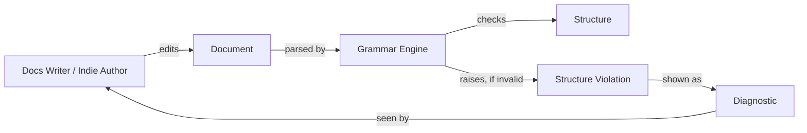
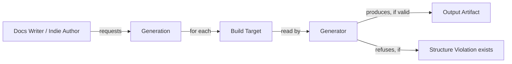
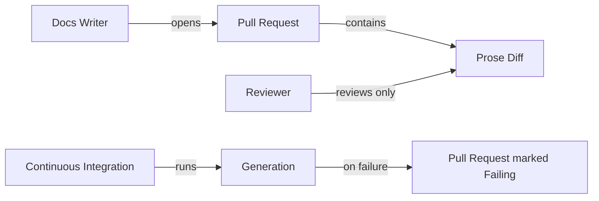

# Domain Storytelling — md-publisher, Iteration 01

**Status: DRAFT — facilitated, not yet founder-accepted (`domain-storytelling:accept` is a
separate step).**

Source: `03-user-story-map.md`. Every Actor/Work Object/Activity below traces to a backbone
Activity or its stories — no invented vocabulary.

## ⚠️ Methodology-fit note: no real domain expert

The methodology's central discipline is that **the domain expert tells the story**; the facilitator
only draws and asks questions. There is no domain expert here — no docs-as-code writer or indie
author has been interviewed. This is the same founder-delegated-assumption situation as the VPC,
now at higher risk: this workshop's own anti-patterns explicitly name **"Developer-Led Stories"**
and **"Skipping the Workshop: Developers defining vocabulary from code patterns instead of domain
expert conversations"** as failures, and what follows is closer to the latter than the methodology
wants. Every story below is derived from the Story Map (itself founder-delegated) plus the
facilitator's own domain reasoning, **not from a real practitioner's account of their actual work.**
Treat all business rules below as hypotheses to confirm the moment a real docs-as-code writer or
indie author is interviewed — several are marked as open hypotheses rather than frozen facts for
exactly this reason.

## Pictographic tool: Mermaid, not a dedicated canvas

This domain was authored directly from the Story Map in one session, not a live multi-participant
domain-expert session reviewed afterward — the case the methodology's own facilitate step names as
the one where Mermaid may substitute for a dedicated canvas. Mermaid flowcharts are used below for
that stated reason, not by silent default.

## Scope: 3 of 4 backbone Activities

**Get Started (install) is out of scope for domain storytelling.** It has no business rules to
discover — installing a VS Code extension or an npm package is a mechanical action, not a domain
interaction with actors, work objects, and constraint questions. Forcing a "domain story" onto it
would manufacture vocabulary with nothing behind it. The three Activities that do have real domain
content — Write & Validate, Generate Output, Review & Ship — are told below.

---

## Story 1 — Write & Validate

> A **Docs Writer** (or **Indie Author** — the flow is identical for both; see note below) opens a
> **Publication** in the **Editor**. They edit a **Document** within the Publication. The
> **Grammar Engine** parses the Document and checks its structure — cross-references, front
> matter, heading order. If a **Cross-Reference** points to a Document or heading that does not
> exist, the Grammar Engine raises a **Structure Violation**. The Docs Writer sees the Structure
> Violation as a **Diagnostic** in the Editor and corrects the Document.

**Note on the shared flow:** Docs Writer and Indie Author go through an identical sequence here —
the Grammar Engine does not distinguish them (no RBAC per H15). This is itself a finding worth
carrying into Architecture Design: validation is role-agnostic.

**Business rules (constraint question asked on every story: already there / already taken /
missing / out of order):**

- **BR-1 (missing):** A Cross-Reference to a nonexistent Document or heading is always a Structure
  Violation — never a warning, never silently ignored.
- **BR-2 (out of order):** A Document's front matter must appear before any content; a Structure
  Violation is raised if it does not.
- **BR-3 (out of order):** Heading levels may not skip a level (e.g. H1 directly to H3) — raised as
  a Structure Violation.
- **BR-4 (already taken):** Two headings that would produce the same cross-reference anchor is a
  Structure Violation (an ambiguous target) — not resolved by silently picking the first match.

## Story 2 — Generate Output

> A Docs Writer or Indie Author requests **Generation** of a Publication to one or more **Build
> Targets** (DOCX, PDF, EPUB, or Web). The **Generator** reads the Publication's validated Document
> tree. For each requested Build Target, the Generator produces an **Output Artifact**. If the
> Publication has an unresolved Structure Violation, the Generator refuses to produce any Output
> Artifact and reports the Structure Violation instead.

**Business rules:**

- **BR-5 (already there) — founder-confirmed 2026-09-27:** Generation silently overwrites an
  existing Output Artifact at the same destination, no warning or flag required. The Publication is
  always the source of truth; regenerating simply replaces whatever was there, matching typical
  build-tool behavior. This was a product call with no upstream basis from BMC/VPC/Story Map, not a
  discovered rule — recorded as such, not presented as if it had been.
- **BR-6 (missing):** Some Build Targets have format-specific structural requirements beyond
  generic validation (e.g. EPUB needs a navigable table of contents) — the Generator raises a
  **Build-Target Violation**, distinct from a general Structure Violation.
- **BR-7 (out of order):** Build Targets are independent of each other and may be generated in any
  order or subset — no Build Target depends on another having been generated first. (Architecture-
  relevant: this rules out a pipeline where, say, PDF generation depends on DOCX having run.)

## Story 3 — Review & Ship

> A Docs Writer opens a **Pull Request** containing changes to a Publication's Documents. A
> **Reviewer** reviews the **Prose Diff** — the changed Document content — without needing to
> inspect any Output Artifact. If **Continuous Integration** runs Generation and it fails (a
> Structure Violation or Build-Target Violation), the Pull Request is marked failing and the
> Reviewer is not expected to review further until it is fixed.

*(Indie Author has no story here — the VPC/Story Map named no review job for that segment; not
invented.)*

**Business rules:**

- **BR-8 (already there):** Output Artifacts are never committed to the Publication's source
  repository — they are always freshly generated by CI or on demand, never stored alongside
  source. (Resolves the Story Map's own noted architectural implication from Sprint 2.)
- **BR-9 (missing):** Generation and validation work identically whether run locally or in CI — CI
  is not a separate code path, only a different invocation context.
- *(Out of order — "a Reviewer approves before CI finishes" — is ordinary pull-request mechanics
  belonging to the git-hosting platform, not a domain rule of md-publisher itself; not forced into
  a rule it doesn't own.)*

---

## Frozen Vocabulary Table

| Domain Term | Type | Frozen Code Name |
| --- | --- | --- |
| Docs Writer | Actor → Role | `DocsWriter` |
| Indie Author | Actor → Role | `IndieAuthor` |
| Publication | Work Object | `Publication` |
| Document | Work Object | `Document` |
| Editor | System Actor | `Editor` (the VS Code extension / LSP client) |
| Grammar Engine | System Actor | `GrammarEngine` |
| Cross-Reference | Work Object | `CrossReference` |
| Structure Violation | Domain Event | `StructureViolation` |
| Diagnostic | Work Object | `Diagnostic` |
| Generator | System Actor | `Generator` |
| Build Target | Value (enum: Docx, Pdf, Epub, Web) | `BuildTarget` |
| Output Artifact | Work Object | `OutputArtifact` |
| Build-Target Violation | Domain Event | `BuildTargetViolation` |
| Pull Request | Work Object (external, git-hosting) | `PullRequest` |
| Reviewer | Actor | `Reviewer` |
| Prose Diff | Work Object | `ProseDiff` |
| Continuous Integration | System Actor | `ContinuousIntegration` |

No synonyms were tolerated: "Publication" and "Document" are kept distinct (a Publication is the
whole source tree; a Document is one file within it) rather than used interchangeably.

## New hypothesis opened by this workshop

| ID | Hypothesis | Owning workshop |
| --- | --- | --- |
| H16 | Silently overwriting the Output Artifact on every generation (BR-5, founder-confirmed 2026-09-27) won't surprise or frustrate real users once tested — the decision itself isn't in question, only whether it holds up once someone hits it in practice. | Domain Storytelling |

H1–H15 are not superseded. All sixteen (H1–H16) carry forward to MVP Planning (Workshop 8).
