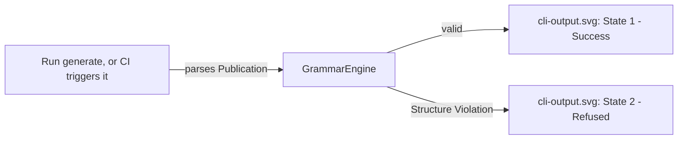
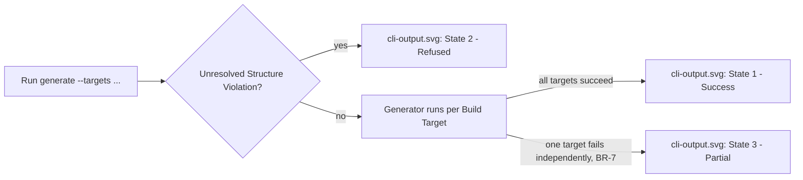
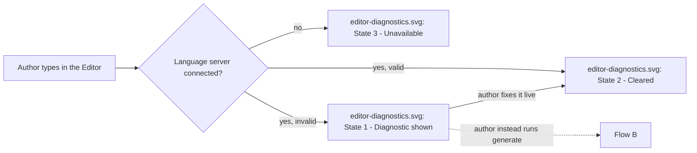

# UX Design — md-publisher, Iteration 01

**Status: DRAFT — facilitated, not yet founder-accepted (`ux-design:accept` is a separate step).**

Source: `06-three-amigos.md`. Every mockup state and screen-flow transition below traces to a
specific `Then`/`When` clause — no screen designed speculatively.

## Two key screens, not more — and why

md-publisher is a CLI + VS Code extension, not a GUI application. Most `Then`/`When` clauses in
`06-three-amigos.md` describe a state or action rendered by a **different** system's UI — the VS
Code Marketplace installer, npm's own terminal output, a third-party e-reader app, GitHub's Pull
Request UI — which md-publisher does not design and has no control over. Designing screens for
those would be the **Untraceable Screens** anti-pattern (inventing UI for something not actually
being built). Only two things are UI md-publisher itself renders:

1. **`mockups/cli-output.svg`** — the CLI's own terminal output.
2. **`mockups/editor-diagnostics.svg`** — the VS Code editor's inline diagnostics.

Both are real, hand-authored SVG wireframes (`<rect>`/`<text>`/`<path>`), not Mermaid — per the
workshop's non-negotiable format rule.

## Traceability: every scenario accounted for (no orphaned Gherkin)

Scenario-level, not just Feature-level — a Feature-level pass missed that Feature 6 also has a
"refused" scenario, and that Feature 5's subset/regenerate scenarios aren't a visually distinct
state from its success state. Fixed here.

| Feature | Scenario | Screen state | Reasoning |
| --- | --- | --- | --- |
| 1 — Install Extension | all 3 | *(none)* | VS Code's own Marketplace/installer UI. |
| 2 — Install CLI | all 3 | *(none)* | npm's own terminal output. |
| 3 — Cross-References at Build Time | valid / broken / duplicate-anchor | `cli-output.svg` State 1 (valid case is the success state, not separately drawn) / State 2 / State 2 | Structure Violation report; the "no violation" case is State 1's absence of any error block. |
| 4 — Internal Links at Build Time | front-matter / heading-skip | `cli-output.svg` State 2 (shared mechanism) | Same CLI violation report as Feature 3. |
| 5 — Generate DOCX/PDF/Web | all-3-targets | `cli-output.svg` State 1 | Success listing. |
| 5 | subset-of-targets | `cli-output.svg` State 1 pattern (not separately drawn) | Same success-listing state type, fewer lines — a subset of State 1's checkmarks, not a new visual state. |
| 5 | refused-on-violation | `cli-output.svg` State 2 | Structure Violation report. |
| 5 | regenerate/overwrite | `cli-output.svg` State 1 pattern (not separately drawn) | Visually identical to a fresh success run — the `Then` being tested is the *absence* of a confirmation prompt, which State 1 already shows by not containing one. |
| 6 — Generate EPUB/PDF | both-targets-success | `cli-output.svg` State 1 pattern (not separately drawn) | Same success-listing state type as Feature 5. |
| 6 | build-target-violation-partial | `cli-output.svg` State 3 | The state this Feature's mockup coverage is actually about. |
| 6 | refused-on-violation | `cli-output.svg` State 2 | Same refusal state as Feature 5 — **missed in the first draft of this table**, added on re-check. |
| 7 — EPUB Navigation | both scenarios | *(none)* | A third-party e-reader's UI. |
| 8 — Live Diagnostics (Docs Writer) | typing / fixing-live / LSP-unavailable | `editor-diagnostics.svg` States 1 / 2 / 3 | The one screen this story is about. |
| 9 — Live Diagnostics (Indie Author) | typing | `editor-diagnostics.svg` State 1 (shared) | Same editor surface, not mocked twice. |
| 10 — Review Prose Diff | all 3 scenarios | *(none)* | GitHub's own PR diff/checks UI. |

Every scenario in every Feature is accounted for above — either mapped to a mockup state (drawn or
a stated pattern-match against a drawn state) or explicitly marked as another system's UI.

## Screen-flow diagrams

**3 diagrams, not 10 — consolidated across Story Cards that share a screen and a flow, not one per
Story Card mechanically.** See the transcript for the reasoning. Features 1, 2, 7, and 10 have no
diagram — they have no md-publisher-rendered screen to flow between.

### Flow A — Validate at build time (Features 3, 4)

### Flow B — Generate output (Features 5, 6)

### Flow C — Live validation while typing (Features 8, 9)

## Interaction specs

Interaction specs are written directly on each mockup SVG (see the "Interaction notes" region of
`cli-output.svg` and `editor-diagnostics.svg`) rather than duplicated here in prose — per the
workshop's own anti-pattern warning against prose-only specs that aren't backed by the mockup
itself.

## New hypothesis opened by this workshop

None — every mockup state traces to an already-established Gherkin clause; nothing here is a new
unvalidated claim.
